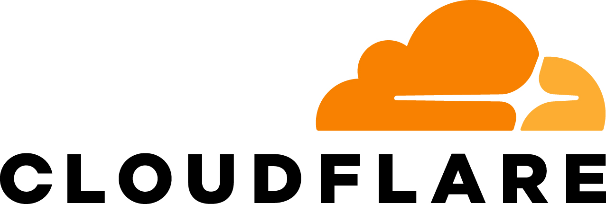

# Deploy a production-ready, real-time web app with Cloudflare Workers

<details>
<summary>Technical Summary</summary>

This template is a client-first TanStack Start app. TanStack Start is used in
SPA mode, so the build creates a static `dist/client/index.html` shell and
client assets. The browser talks to Convex for real-time data and Convex Auth
guest sessions.

Cloudflare Workers Static Assets serves the static files. The Cloudflare
dashboard runs `pnpm run build`, which delegates to the Cloudflare-aware build
script. `wrangler.jsonc` owns the asset directory, SPA fallback, and preview URL
behavior.
`.node-version` pins Workers Builds to Node 24 so `node` can run the small
TypeScript helper scripts directly.

Local development runs Convex and the frontend together through `vp run dev`.
Cloudflare builds run Convex deploy first by selecting `CONVEX_DEPLOY_KEY` for
`main` and `PREVIEW_CONVEX_DEPLOY_KEY` for other branches, then build the
static frontend. Local deploy dry-runs run that same build path before asking
Wrangler to validate the upload.

The app includes minimal auth out of the box: users can continue as guests, and
the public todo list keeps guest author attribution.

</details>

## 1. Create accounts

You need:

- [GitHub](https://github.com/)  
  
- [Convex](https://www.convex.dev/)  
  
- [Cloudflare](https://www.cloudflare.com/)  
  

## 2. Copy the app

Create your own GitHub repository from this template.

If you want the clean teaching history, fork the repository instead of using
GitHub's template button. The template button is simpler, but it squashes the
history into one commit.

## 3. Create a Convex project

Open [dashboard.convex.dev](https://dashboard.convex.dev/) and create a project.

From the production deployment settings, create the production deploy key with
exactly these permissions:

- `deployment:deploy`
- `deployment:env:view`
- `deployment:env:write`
- `deployment:data:view`

Do not grant data write, function-run, logs, backups, or integration permissions
to this key. Cloudflare Workers Builds must store it as the build secret named
`CONVEX_DEPLOY_KEY`.

From the project settings, create a Preview deploy key. Preview deploy keys use
Convex's separate project-level preview flow and do not ask for the production
permission list above. Cloudflare Workers Builds must store it as the build
secret named `PREVIEW_CONVEX_DEPLOY_KEY`.

## 4. Create a Cloudflare Worker from GitHub

In Cloudflare, open Workers & Pages and create a Worker connected to your
GitHub repository.

Use these settings:

- Project name: any valid Worker name
- Production branch: `main`
- Build command: keep `pnpm run build`
- Deploy command: `pnpm run deploy`
- Non-production branch deploy command: `pnpm run deploy:preview`
- Path: keep `/`
- Build secret: `CONVEX_DEPLOY_KEY`, using the production key with only
  `deployment:deploy`, `deployment:env:view`, `deployment:env:write`, and
  `deployment:data:view`
- Build secret: `PREVIEW_CONVEX_DEPLOY_KEY`, using the project Preview deploy
  key

Cloudflare Workers Builds can store build variables per production/preview
trigger through the API, but the dashboard setup path does not expose a
Pages-style environment selector for build variables. This template uses the two
secrets above and lets `scripts/build-cloudflare.ts` select the right one from
`WORKERS_CI_BRANCH`. See
[`docs/cloudflare-workers-builds.md`](./docs/cloudflare-workers-builds.md) for
the deployment contract.

The repository's scripts and `wrangler.jsonc` provide the deployment contract:

```jsonc
// package.json
{
  "scripts": {
    "build": "vp run build:cloudflare",
    "build:app": "tsc && pnpm run generate:cloudflare-redirects && vp build",
    "build:cloudflare": "node ./scripts/build-cloudflare.ts",
    "check": "tsc && tsc --project convex/tsconfig.json && pnpm run verify:cloudflare-redirects",
    "deploy": "node ./scripts/deploy-cloudflare.ts deploy",
    "deploy:preview": "node ./scripts/deploy-cloudflare.ts preview",
    "generate:cloudflare-redirects": "node ./scripts/generate-cloudflare-redirects.ts",
    "verify:cloudflare-redirects": "pnpm run generate:cloudflare-redirects && git diff --exit-code -- public/_redirects",
  },
}

// wrangler.jsonc
{
  "preview_urls": true,
  "assets": {
    "directory": "./dist/client",
    "html_handling": "none",
    // Cloudflare SPA mode serves /index.html for unknown app routes. Keep
    // vite.config.ts emitting the TanStack Start shell there.
    "not_found_handling": "single-page-application",
  },
}
```

`scripts/cloudflare-prerender-pages.ts` is the source of truth for public
prerendered pages. `scripts/generate-cloudflare-redirects.ts` rewrites only the
tagged generated block in `public/_redirects`, so custom Cloudflare redirects can
live outside that block. `_redirects` is applied before asset serving, so keep
custom rules exact; Cloudflare SPA mode owns app-route fallback through
`/index.html`. The committed `_redirects` file is the review surface for the
generated exact aliases.

The `.node-version` file pins Cloudflare's build image to Node 24. That keeps
the helper scripts typed while still running them with plain `node`.

## 5. Run locally

Install dependencies:

```sh
pnpm install
```

Start Convex and TanStack Start together:

```sh
pnpm run dev
```

The dev script creates Convex Auth JWT keys in your development deployment if
they are missing.

For an isolated local agent or worktree backend:

```sh
pnpm run dev:worktree
```

## 6. Validate deploy config locally

```sh
CLOUDFLARE_WORKER_NAME=my-worker pnpm run deploy:dry-run
```

This runs the Cloudflare build path, then asks Wrangler to validate the upload
without publishing anything. If neither Convex deploy key is set locally,
the Cloudflare build script skips Convex deploy and only builds the static app.
When a Convex deploy key is selected, the build script creates Convex Auth JWT
keys in that deployment if they are missing.

Preview-version checks use the same local name:

```sh
CLOUDFLARE_WORKER_NAME=my-worker pnpm run deploy:preview:dry-run
```

## Why Workers

Cloudflare Pages works well for static apps, but several important settings live
in the dashboard: build command, output directory, and Pages-specific deploy
behavior.

With Workers Static Assets, the deploy shape is split cleanly: Cloudflare's Git
build step runs `pnpm run build`, production deploys run `pnpm run deploy`, and
branch previews run `pnpm run deploy:preview`. `wrangler.jsonc` describes the
assets and SPA fallback without hard-coding the Worker name. That makes the
deployment easier to audit, easier for agents to modify, and easier for users
to reproduce.

## Read the history

```sh
git log --oneline --reverse
```

The history is intentionally written as a tutorial. `REPO_HISTORY.md` explains
what each numbered commit added and why.
